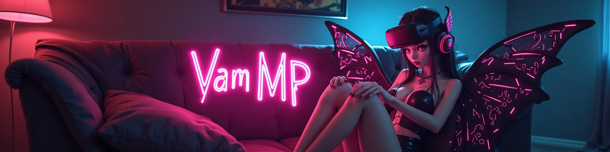
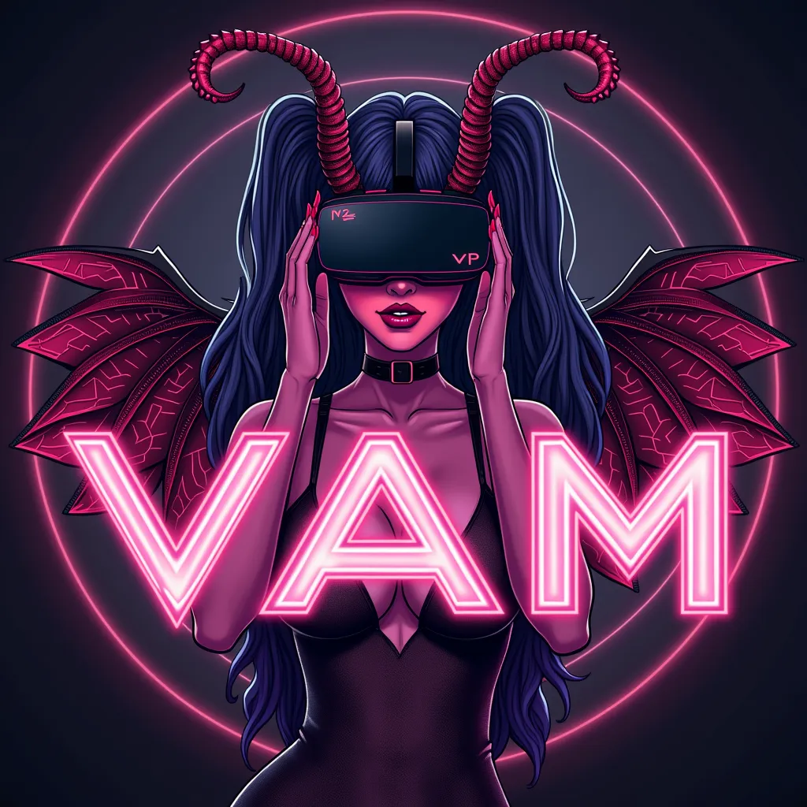

# VaM Multiplayer Revamped Plugin

This project expands on vamrobot's VaM Multiplayer Plugin:
[VaM Multiplayer Plugin by vamrobot](https://github.com/vamrobot/vammultiplayer)

## Overview
I have launched a centralized Linux server in Azure and added simple user registration via a Discord bot, eliminating the need for complex VPN or tunneling setups. This makes the plugin as easy to use as the MetaChat plugin.

[**TL;DR below**](https://github.com/vammultipl/vammultiplayer_revamped?tab=readme-ov-file#tldr-i-came-from-metachat---how-do-i-use-this)

[**Linktree - make a small donation**](https://linktr.ee/vammultipl)

[**Hub link**](https://hub.virtamate.com/resources/vam-multiplayer-revamped.48624/)

### New Features
- Centralized server
- Simple user registration by IP and lobby monitoring via Discord bot
- Enhanced performance and optimization
- Improved player movement smoothness
- Faster connection and gameplay compared to MetaChat
- Simplified data syncing (only necessary data - player joints and clothing on/off)
- Spectator mode
- Clothing sync support (on/off status, no .var syncing yet)

## Technical Details
The client plugin:
- Scans available Player atoms and their names on initialization.
- Syncs the controlled player’s joints with the server.
- Receives other controlled players' joints from the server.
- Does not check or sync scene content (uncontrolled atoms, user data).
- Any scene can be used, but make sure all players in the room load the same one 

## Installation
The client plugin is a single [VAMMultiplayer.cs](https://raw.githubusercontent.com/vammultipl/vammultiplayer_revamped/main/VAMMultiplayer.cs) file which can be added to any scene as Scene Plugin. All players must be using the latest version of the plugin.
Hub link with the plugin is [here](https://hub.virtamate.com/resources/vam-multiplayer-revamped.48624/). Download it in game and it will be accessible in plugin search menu.

## Instructions
Default scene we use is [VamMP Love Hotel](https://hub.virtamate.com/resources/vammp-love-hotel.50379/), it has some video tutorials and UI menus for easy use.

Custom scenes:
Open the scene you want to play. It can be any scene with Person atoms in it. Best remove any Timeline animations from it. Send the same scene .var file to other players so they can load the same one.

### Connecting to the Server
Important: Before attempting to connect, you must register with the Discord bot via DM. The server will not allow unregistered IPs to connect. Registrations are valid for one week.
1. **Open Plugin settings**
   - Go to Scene Plugins
   - Add [VAMMultiplayer.cs](https://raw.githubusercontent.com/vammultipl/vammultiplayer_revamped/main/VAMMultiplayer.cs) plugin if not already in the scene
   - Open plugin settings ("Open Custom UI")
2. **Player Selection:**
   - Choose a Player to control or select Spectator mode to watch.
   - Ensure the port (8888 or 9999) matches the room (room 1 or 2) you want to join.
3. **Connecting:**
   - Click "Connect to Server"; it may take a few seconds.
   - If disconnected immediately, register your IP with the Discord bot. Registrations last a week.
   - Check player status in the plugin window or via the Discord bot. You'll see an alert window pop up when someone joins or leaves the room.
   - Server might also disconnect you if selected Player is already controlled. Select a different one and reconnect.
4. **Settings:**
   - Avoid changing Update Frequency

### Tips
- Read instructions in plugin window (scroll down)
- If you encounter issues, click Disconnect and Connect again.
- Reload the plugin if problems persist.
- Make sure to use the latest available version of the client plugin.
- Click an option in GiveMeFPS plugin (added to scene) for more FPS.
- If you encounter desync of other players (crooked limbs, whatever), apply some basic pose preset on them. It should cause a resync.

### Scenes
- **All players in the same room must use the same scene with pre-defined atoms.**
- Scene modifications (changing looks, adding atoms etc) on your end won’t sync with others. Only clothes on/off status is synced.
- The scene must be shared with other players on Discord first so that everyone sees the same things and has the same atoms. Otherwise, you can assume the default scene is used. Remember to download all dependencies for the scene. Use AppearanceLoader plugin if you want to use different look but coordinate with others so they change it too for consistency.
- Plugins also don't sync if you modify them, except for plugins like AutoThruster (as it moves the atoms)
- Most popular scenes are: [XXXperience](https://hub.virtamate.com/resources/vam-mp-xxxperience.48719/) and [Love Hotel with a VAMMP video tutorial!](https://hub.virtamate.com/resources/vammp-love-hotel.50379/)

### Syncing
- Only Player joints and clothes status are synced; other elements like sex toys or UI changes are local and interaction with them is not visible to others.

## Registration and Commands
Currently [this Discord server](https://discord.gg/gsw2ERM8c2) has the registration bot.

To register your IP, type `/register <your IP>` in a DM to the bot, for example: `/register 1.2.3.4`. Use a site like https://whatismyip.com to check your public IP.
The registration is active for 1 week, then you have to re-register.

## Troubleshooting
If you can't connect to the server, it might be due to:
- The player you are trying to control is already being controlled
- You are not registered (register with the bot again)
- Server being down (unlikely)
- Room being full (verify with Discord bot)
- Not using latest version of the client plugin
- If all else fails - click Reload to reload plugin, reconnect

## Lobbies
- Two rooms are available, running in parallel on ports 8888 and 9999, max 7 players per room.
- The Discord bot shows which players are connected to which room.
- Registration works for both rooms.

## Security and Privacy
- No user data is stored on the server apart from registered user IPs and Discord usernames, which expire periodically.
- Discord bot displays Discord nicknames of connected players.
- TCP connection is not protected by SSL; data is in plaintext.
- IPs not in the allowlist managed by the Discord bot are immediately disconnected.

## Known Issues
- Cannot change clothing of another look if it is being controlled by a player

## TL;DR I came from Metachat - how do I use this?
MetaChat had web registration, lobbies with visible scenes, an in-game menu to synchronize other people's looks, and also a chat. This has none of that.
Instead:
- join [this Discord server](https://discord.gg/gsw2ERM8c2)
- registration is via Discord bot: `/register <your_IP>`
- to check who's playing - ask Discord bot or register for notifications
- scene is pre-shared and all players in a lobby should load the same one
- ONLY player atoms joints and clothing on/off state are synced - plugins, looks, toys DO NOT SYNC. Others won't see changes.
- On the up side, no one can make your VaM freeze for 3 minutes by loading a complicated look
- to play: open plugin settings, select your Atom, click Connect :)
- chat is via Discord :)
- hub link has some more info: https://hub.virtamate.com/resources/vam-multiplayer-revamped.48624/

## Additional Help
- Visit the [this Discord server](https://discord.gg/gsw2ERM8c2) where we have a small community of players and scene makers.

For best results - use full body tracking with Embody plugin. Otherwise, put on MetaChatReady pose from old MetaChat toolkit on your atom and move around like section 4.5 says.

There is also a [video tutorial](https://motherless.com/A1A5226) on how to move without full body trackers (tl;dr you grab your knees to move your avatar)

## Hosting Your Own VaM Multiplayer (Optional)
If you want to host everything yourself, you can recreate the whole VaM MP setup easily:
1. Host a Linux server (e.g., free Azure tier or Oracle Linux VMs, or locally on your PC with port 8888 exposed).
2. Run the Python TCP server on your server.
3. Run the Go Discord bot in the same folder to handle user registration.
4. Add the bot to your Discord.
5. Put your Discord bot API token in token.txt
6. Put name of the channel where the bot is in `bot_discord_channel_name.txt`
6. Change the server IP in the Plugin .cs file to your server’s IP (servers.Add line).
7. You now have a VaM Multiplayer setup with full admin rights.
Consult `start_server.sh` script on how to run the servers.

## Donate
https://ko-fi.com/vammultipl

https://donate.stripe.com/bIYaIyeI9ady3wAbIJ

`bitcoin:bc1qpx29nh98c2l22tjfla3f0zchdqgzfm4whqtwgf?message=vammp_donation`

Thanks!

## Official logo

## Credits
Original plugin:
[VaM Multiplayer Plugin by vamrobot](https://github.com/vamrobot/vammultiplayer)
